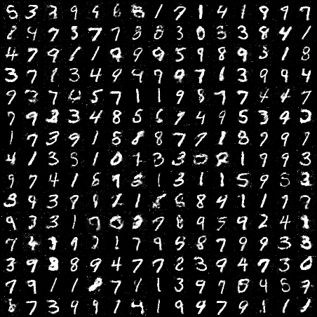
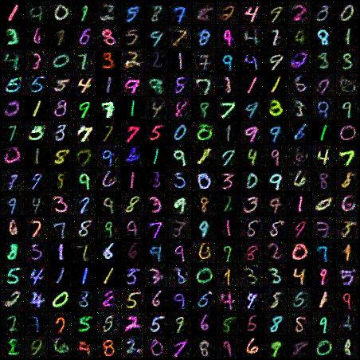

# GANs-Pytorch
GANs-PyTorch is a PyTorch implementation of Generative Adversarial Networks that trains a Generator and Discriminator in an adversarial setup to produce MNIST data.

Research paper reference: https://arxiv.org/pdf/1406.2661.pdf

## Output on MNIST
<div style="display:flex; gap:10px; align-items:center;">
  
  
</div>

## Data preparation
For setting up the mnist dataset:

Follow - https://github.com/Abhaykum123/GANs-Pytorch/blob/main/dataset/mnist_dataset.py

The directory structure should look like this
```
$REPO_ROOT
    -> data
        -> train
                -> 0
                    *.png
                -> 1
                ...
                -> 9
                    *.png
        -> test
                -> 0
                    *.png
                ...
    -> dataset
    -> tools
        
```

# Quickstart
* Create a new conda environment with python 3.11 then run below commands
* ```git clone https://github.com/Abhaykum123/GANs-Pytorch.git```
* ```cd GANs-Pytorch```
* ```pip install -r requirements.txt```
* ```python -m tools.train_gan``` for training and saving inference samples

## Output 
Outputs will be saved every 50 steps in `samples` directory .

During training of GAN the following output will be saved 
* Latest Model checkpoints for generator and discriminator  in ```$REPO_ROOT``` directory

During inference every 50 steps the following output will be saved
* Sampled image grid for in ```samples/*.png``` 


## Author
Abhay kumar
